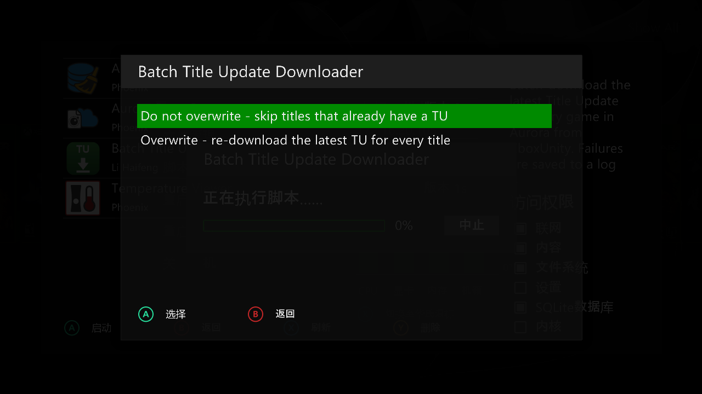
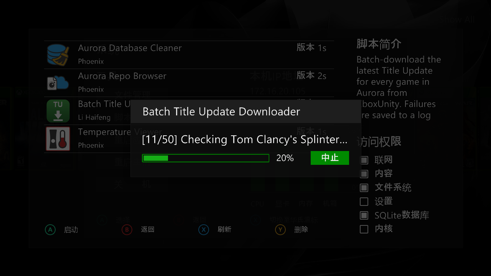
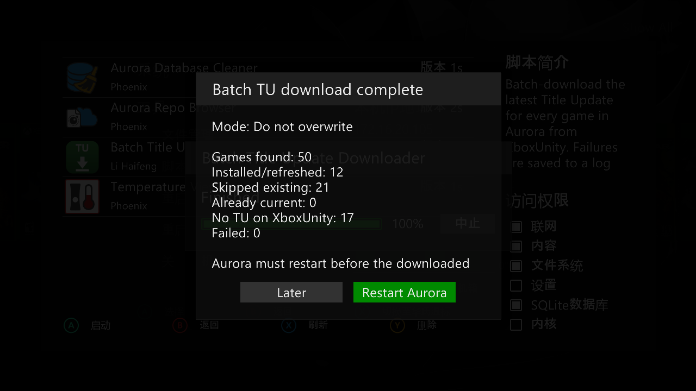

# Aurora Batch TU Downloader

A batch Title Update downloader script for Xbox 360 Aurora Dashboard.

Automatically scans Aurora games, downloads the latest TU from XboxUnity, and updates Aurora Title Update records.

## Installation

Copy the script folder to:

```
Hdd1:\Aurora\User\Scripts\
```

Restart Aurora and launch:

```
Scripts → Batch Title Update Downloader
```

## Screenshots

### Menu



### Scan/Download



### Result



## Log

Failed downloads are recorded:

```
Game:\Data\Logs\BatchTUDownloader_Failures.log
```

## Credits

Based on TUDownloader by:

- Swizzy
- EccentricVamp

Batch enhancements by Li Haifeng
